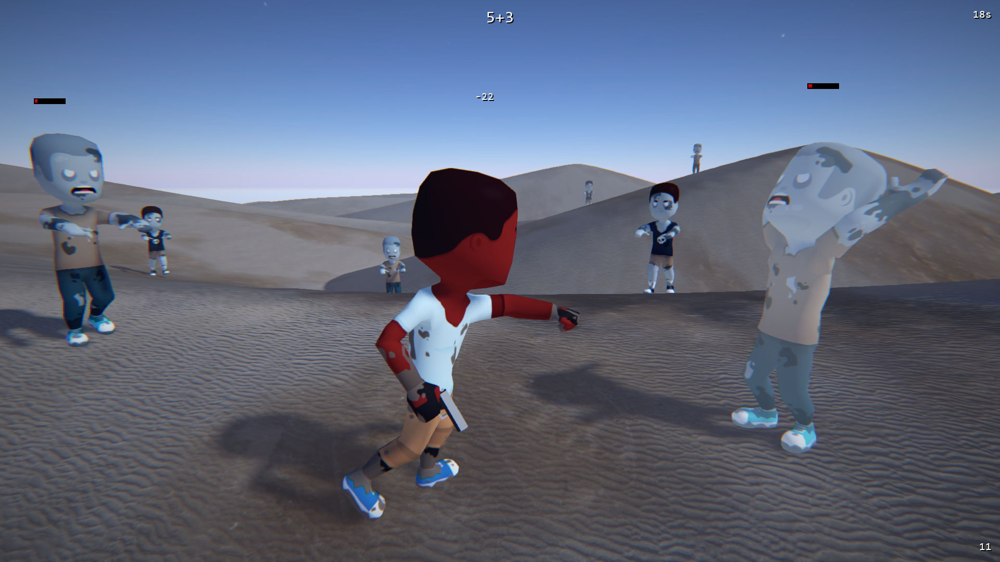
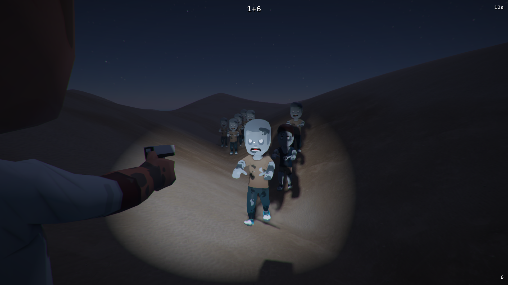
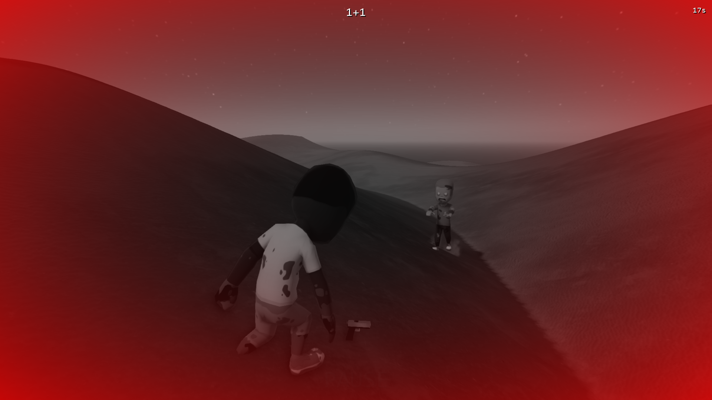
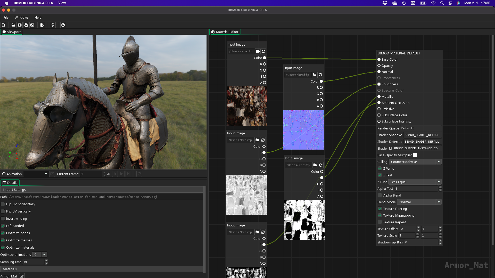

# BBMOD
> The most powerful 3D rendering solution for GameMaker

[](LICENSE)
[](https://discord.gg/ep2BGPm)

# Table of Contents
* [About](#about)
* [Features](#features)
* [Tutorials, documentation and help](#tutorials-documentation-and-help)
* [Demo project](#demo-project)
* [Support the development](#support-the-development)
* [Links](Links)
* [Special thanks](#special-thanks)

# About
BBMOD is the most powerful 3D rendering solution for GameMaker. We at BlueBurn believe that making 3D games in GameMaker should be for everyone and BBMOD fully reflects this idea with its simple workflow and powerful, yet easy to use GML Code library. Using our model conversion tool BBMOD CLI, you first convert your model from a common format like `FBX`, `COLLADA`, `OBJ` or `glTF` (the full list can be found [here](https://blueburn.cz/bbmod/docs/3/SupportedFileFormats.html)) into a custom binary format specially crafted for fast loading in GMS2. Then, using the GML library, you can easily load the converted model (and its animations) and render it in just a few lines of code:

```gml
// Load model
model = new BBMOD_Model("Data/Model.bbmod");

// Create and assign material
material = BBMOD_MATERIAL_DEFAULT.clone();
material.BaseOpacity = sprite_get_texture(SprTexture, 0);
model.set_material("Material", material);

// Render model
bbmod_material_reset();
model.submit();
bbmod_material_reset();
```

Thanks to the BBMOD's powerful material system and physically based shaders, you can even use assets created in professional, industry standard software!

# Features
## Easy to learn
BBMOD library was designed to be as accessible as possible. Whether you are a beginner or an advanced GameMaker user, you will be able to make the most out of it!

## Modern
BBMOD is clean and object-oriented, utilizing the latest GML Code features of GameMaker.

## Module based
The entire library is split into folders or "modules", each adding more and more functionality, but only one of them is absolutely necessary! The more comfortable you get with BBMOD, the more of them you can use. Or stick to the basics, it is up to you and your project's needs!

## Fully documented
From individual variables to entire structs and their methods, every little part of the library is documented. Each release also comes with a changelog so you know exactly what has changed!

## The most powerful
BBMOD keeps developing and pushing 3D rendering in GameMaker even farther, so you can focus on making your game and let it do the heavy lifting for you!

## Material system
BBMOD has a powerful and unique material system which allows you to sort draw calls on per-mesh basis. No more issues with drawing order of instances!

## Animations
Skeletal animations are fully supported, even motion capture! Using animation state machines you will be able to add characters to your game in no time.

## Dynamic lights and shadows
Create beautifully lit environments with BBMOD's built-in support for dynamic lights and shadows!

## Physically based rendering
With support for metallic-roughness material workflow and image based lighting, you can use assets created in professional, industry standard software, that you would normally see in AAA 3D game engines.

## Terrain rendering
One of the many modules is a Terrain module, using which you can easily create and render heightmap based terrains with up to five material layers controlled with a splatmap!

## Post-processing & anti-aliasing
Make your game stand out with effects like color grading, chromatic aberration, vignette and more! BBMOD will also help you get rid of the jaggies using FXAA.

## Dynamic batching
When performance is of concern, BBMOD comes with various trick for increasing FPS, like dynamic batching! Using dynamic batching you can render multiple instances of moving models in a single draw call.

## Utilities
Using built-in GML functions can often times feel a little clunky. BBMOD fixes that by providing you with various utility functions and structs!

## Multiplatform
From desktop and consoles to mobile and browsers! We make sure that BBMOD runs on every platform supported by GameMaker.

# Tutorials, documentation and help
Tutorials for BBMOD can be found on its homepage at https://blueburn.cz/bbmod/tutorials. An online documentation for the latest release of BBMOD is always available at https://blueburn.cz/bbmod/docs/3. If you need any additional help, you can join our [Discord server](https://discord.gg/ep2BGPm) or contact us on [GMC forums](https://forum.yoyogames.com/index.php?threads/60628).

# Demo project




To help you get started, BBMOD comes with a little demo project for you to explore, modify and maybe turn into your first complete 3D game! You can play it right now in your browser at https://blueburn.cz/bbmod/demo.

*Assets used in the demo project are created by [Kenney.nl](https://www.kenney.nl/).*

# Support the development
Support us in developing BBMOD, get priority assistance and more of our amazing tools as a reward! [Become our Patron](https://www.patreon.com/blueburn).


*[BBMOD GUI](https://blueburn.cz/index.php?menu=bbmod_gui) - Model converter with live preview, material editor and more*


*[PushEd 2](https://blueburn.cz/index.php?menu=pushed2) - 2D & 3D level editor for GameMaker*

# Links
* [BBMOD GUI](https://blueburn.cz/index.php?menu=bbmod_gui)
* [Discord](https://discord.gg/ep2BGPm)
* [Documentation](https://blueburn.cz/bbmod/docs/3)
* [Tutorials](https://blueburn.cz/bbmod/tutorials)
* [GameMaker Community](https://forum.yoyogames.com/index.php?threads/60628)
* [Official website](https://blueburn.cz/index.php?menu=bbmod)
* [Patreon](https://www.patreon.com/blueburn)
* [Play demo](https://blueburn.cz/bbmod/demo)
* [PushEd 2](https://blueburn.cz/index.php?menu=pushed2)
* [Trello board](https://trello.com/b/XKnnTduD/bbmod)
* [YoYo Games Marketplace](https://marketplace.yoyogames.com/assets/10210/bbmod-3)

# Special thanks
* To [Assimp](https://github.com/assimp/assimp) for making BBMOD CLI possible!
* To [Kenney.nl](https://www.kenney.nl/) for CC0 assets used in the demo project!
* To [Poly Haven](https://polyhaven.com/) for CC0 textures used in the demo project!
