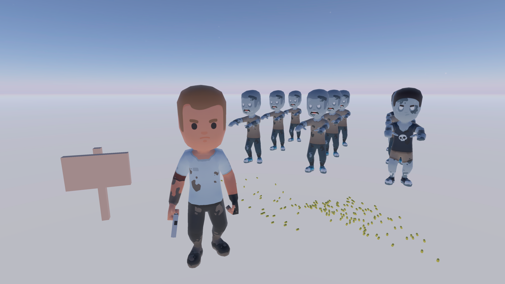

# BBMOD
> 3D rendering solution for GameMaker Studio 2

# Table of Contents
* [About](#about)
* [Documentation and help](#documentation-and-help)
* [Links](Links)
* [Special thanks](#special-thanks)

# About
BBMOD is an advanced 3D rendering solution for GameMaker Studio 2. It consists
of a custom model and animation file formats (`*.bbmod`, `*.bbanim`), a model
convertor (BBMOD CLI), a powerful and easy to use GML library, as well as PBR
shaders using which you can render models textured in professional, industry
standard software.

# Documentation and help
An online documentation for the latest release of BBMOD can be found at https://blueburn.cz/bbmod/docs/3/. The documentation source is available in the `docs_src` folder and it can be built into an HTML format using [GMDoc](https://marketplace.yoyogames.com/assets/10014/gmdoc-2). If you need any additional help, feel free to contact us on the [GMC forums](https://forum.yoyogames.com/index.php?threads/60628), or you can join our [Discord server](https://discord.gg/ep2BGPm).

# Links
* [Discord](https://discord.gg/ep2BGPm)
* [Documentation](https://blueburn.cz/bbmod/docs/3/)
* [GameMaker Community](https://forum.yoyogames.com/index.php?threads/60628)
* [YoYo Games Marketplace](https://marketplace.yoyogames.com/assets/10210/bbmod-3)

# Special thanks
* To [Assimp](https://github.com/assimp/assimp) for making BBMOD CLI possible!
* To [kenney.nl](https://www.kenney.nl/) for assets used in the demo project!
