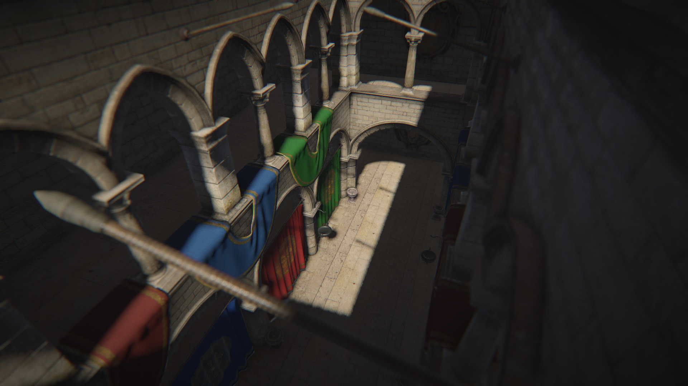
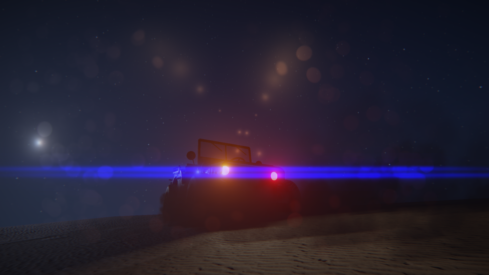
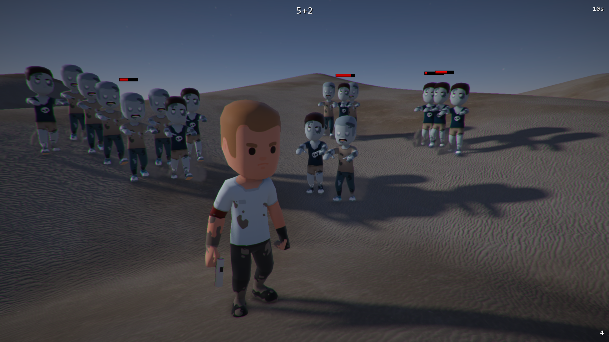

<p align="center">
  
</p>

> Make 3D games in GameMaker!

[](LICENSE)
[](https://discord.gg/ep2BGPm)

> [!WARNING]
> You are viewing the development branch of BBMOD 3. Feel free to experiment with the [yet-unreleased changes](Changelog.md), but expect bugs and unfinished features. The release branch can be found [here](https://github.com/blueburncz/BBMOD/tree/bbmod3).

## Table of Contents

* [About](#about)
* [Screenshots](#screenshots)
* [Documentation, tutorials, samples and help](#documentation-tutorials-samples-and-help)
* [Building BBMOD CLI and DLL](#building-bbmod-cli-and-dll)
* [License](#license)
* [Logo terms of use](#logo-terms-of-use)
* [Links](Links)
* [Special thanks](#special-thanks)

## About

BBMOD is a library that makes creating 3D games in GameMaker easier! Whether you just need to draw 3D models in 2D games or you are building fully immersive 3D worlds, BBMOD helps you bring your vision to life! For more info, please see its homepage <https://blueburn.cz/bbmod/>.

## Screenshots


*[Sponza](https://github.com/kraifpatrik/Sponza-BBMOD)*


*[Vehicle demo](https://github.com/blueburncz/BBMOD-Vehicle-Demo)*


*[Zombie demo](https://github.com/blueburncz/BBMOD-Zombie-Demo)*

## Documentation, tutorials, samples and help

An online documentation for the latest release of BBMOD is always available at <https://blueburn.cz/bbmod/docs/3>. Tutorials for BBMOD can be found on its homepage at <https://blueburn.cz/bbmod/tutorials>. There are also some sample projects available in the showcase section <https://blueburn.cz/bbmod/showcase>. If you need any additional help, you can join our [Discord server](https://discord.gg/ep2BGPm).

## Building BBMOD CLI and DLL

Requires [CMake](https://cmake.org) version 3.23 or newer!

### 1. Build BBMOD CLI and DLL

```sh
git clone --recurse-submodules https://github.com/blueburncz/BBMOD.git
cd BBMOD/BBMOD_CPP
cmake -S . -B build -DCMAKE_POLICY_VERSION_MINIMUM="3.10"
cmake --build build --config=Release
```

This builds both BBMOD CLI and DLL copies all files into `BBMOD_GML/datafiles/Data/BBMOD`.

### 2. Fix rpaths and codesign (for macOS)

* Check rpaths:

```sh
otool -l libBBMOD.dylib | grep -B 1 -A 2 LC_RPATH
```

* Remove bad rpaths:

```sh
install_name_tool -delete_rpath "/Volumes/KINGSTON/Git/BBMOD/BBMOD_CPP/lib" libBBMOD.dylib # Replace with the path you got from the previous command
```

* Add rpaths:

```sh
install_name_tool -add_rpath "@executable_path/data/bbmod" libBBMOD.dylib
install_name_tool -add_rpath "@loader_path/" libBBMOD.dylib
install_name_tool -add_rpath "@executable_path/../Resources/Data/BBMOD" libBBMOD.dylib

install_name_tool -add_rpath "@executable_path/data/bbmod" libassimp.6.dylib
install_name_tool -add_rpath "@loader_path/" libassimp.6.dylib
install_name_tool -add_rpath "@executable_path/../Resources/Data/BBMOD" libassimp.6.dylib
```

* Codesign:

```sh
codesign --force --timestamp --sign "Developer ID Application: Your Name (Y0URT3AM1D)" BBMOD
codesign --force --timestamp --sign "Developer ID Application: Your Name (Y0URT3AM1D)" libBBMOD.dylib
codesign --force --timestamp --sign "Developer ID Application: Your Name (Y0URT3AM1D)" libassimp.6.dylib
```

## License

BBMOD is available under the MIT license. Full text is available [here](LICENSE).

## Logo terms of use

BBMOD logo is property of [BlueBurn](https://blueburn.cz) and you're not allowed to do any modifications to it! **Only uniform scaling is allowed, to change the logo size as required.**

## Links

* [Homepage](https://blueburn.cz/bbmod)
* [Discord](https://discord.gg/ep2BGPm)

## Special thanks

* To [Assimp](https://github.com/assimp/assimp) for making BBMOD CLI possible!
* To [Bane-Me Please](https://vk.com/banemeplease) for extensive testing of BBMOD on Android devices.
* To Gabor Szauer and their [Game Physics Cookbook](https://github.com/gszauer/GamePhysicsCookbook) for making the Raycasting module possible!
